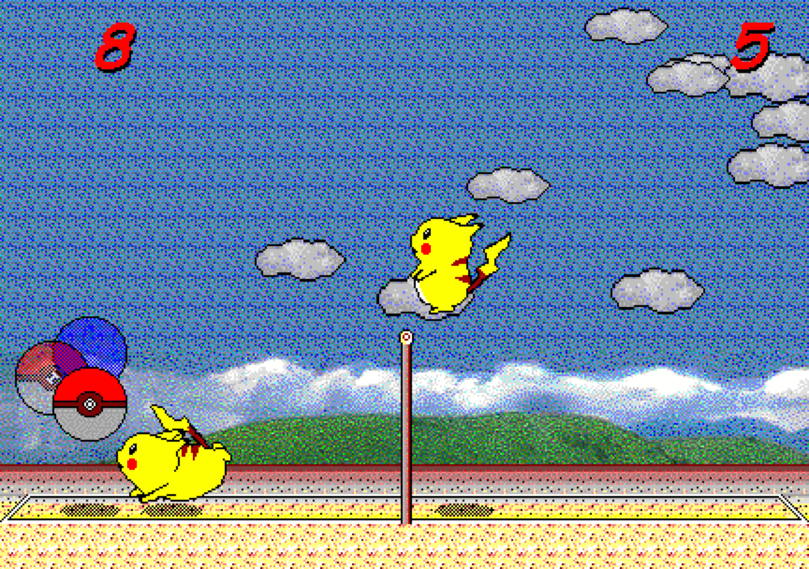

# Pikachu Volleyball with new AI

The original JavaScript version of Pikachu Volleyball is developed by gorisanson.

This is a modified version with new AI.  
There are many skills in new AI, such as super serve/receive, dynamic defense and predict attack.  
You can turn off serve options below to reduce difficulty.  
The 2 players mode is change to AI vs. AI. You can watch a top game in this mode.  
Thank pxter7777 for the serve machine. Thank CBKM for testing.  

You can play this game on the website: https://pika.duckll.tw/

---

# 피카츄 배구

[_English_](README.md) | _&check;_ _Korean(한국어)_

피카츄 배구(対戦ぴかちゅ～　ﾋﾞｰﾁﾊﾞﾚｰ編)는 "(C) SACHI SOFT / SAWAYAKAN Programmers"와 "(C) Satoshi Takenouchi"가 1997년에 만든 윈도우용 게임입니다. 여기에 있는 소스 코드는 이 원조 피카츄 배구 게임의 머신 코드 주요 부분(물리 엔진과 AI 등)을 리버스 엔지니어링하여 자바스크립트로 구현한 것입니다.

https://gorisanson.github.io/pikachu-volleyball/ko/ 에서 이 피카츄 배구를 플레이할 수 있습니다.

## 게임 구조

- 물리 엔진: 공과 플레이어(피카츄)의 위치를 계산하는 물리 엔진은 [`src/resources/js/physics.js`](src/resources/js/physics.js) 파일에 담겨 있습니다. (플레이어가 컴퓨터와 대전 시 컴퓨터의 키보드 입력을 결정하는 AI도 동일한 파일에 담겨 있습니다.) 이 소스 코드 파일은 원조 게임의 머신 코드 00403dd0 주소에 위치한 함수를 리버스 엔지니어링하여 작성한 것입니다.

- 렌더링: [PixiJS](https://github.com/pixijs/pixi.js) 라이브러리를 사용하였습니다.

더 자세한 사항은 [`src/resources/js/main.js`](src/resources/js/main.js) 파일에 있는 주석에서 볼 수 있습니다.

## 리버스 엔지니어링 방법

다음 프로그램들을 사용했습니다.

- [Ghidra](https://ghidra-sre.org/)
- [Cheat Engine](https://www.cheatengine.org/)
- [OllyDbg](http://www.ollydbg.de/)
- [Resource Hacker](http://www.angusj.com/resourcehacker/)

[Ghidra](https://ghidra-sre.org/)는 머신 코드를 C 코드로 디컴파일할 때 사용했습니다. 디컴파일된 C 코드를 처음 봤을 때는 막막했습니다. 한 가지 이유는 변수들의 이름과 함수들의 이름이 `iVar1`, `iVar2`, `FUN_00402dc0`, `FUN_00403070`, ... 이런 식이라 이게 어떤 변수이고 어떤 역할을 하는 함수인지 알 수 없었기 때문입니다. 공의 좌표 변수가 머신 코드 어느 지점에서 엑세스 되는지 한번 알아나보자는 생각으로 [Cheat Engine](https://www.cheatengine.org/)을 사용하여 해당 위치를 알아내었고, 거기서부터 디컴파일된 C 코드를 읽어내려가니 코드가 해석이 되기 시작했습니다. [OllyDbg](http://www.ollydbg.de/)는 머신 코드의 일부분을 바꾸는데 사용했습니다. 예를 들어, 새 라운드가 시작할 때 "Ready?" 메시지가 깜빡 거리는데 이 때 재생되는 프레임 수가 몇 개인지 세기위해 게임 속도를 느리게 만들 때 사용했습니다. [Resource Hacker](http://www.angusj.com/resourcehacker/)는 게임 리소스(스프라이트, 소리)를 추출할 때 사용했습니다.

## 원조 게임과 일부러 다르게 한 사항

키보드 입력이 없는 경우, 얼마의 시간이 지나면 AI 대 AI 경기가 시작됩니다. 원조 게임에서는 이 경기가 약 40초간만 진행됩니다. 이 자바스크립트 버전에서는 이 AI 대 AI 경기의 제한 시간이 없으므로, 마음 놓고 원하는 만큼 관전할 수 있습니다.
