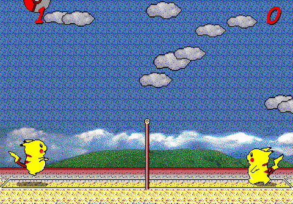

# Pikachu Volleyball

_&check;_ _English_ | [_Korean(한국어)_](README.ko.md)

Pikachu Volleyball (対戦ぴかちゅ～　ﾋﾞｰﾁﾊﾞﾚｰ編) is a classic game which was developed by "(C) SACHI SOFT / SAWAYAKAN Programmers" and "(C) Satoshi Takenouchi" in 1997. The source code on this repository is gained by reverse engineering the core part of the machine code of the original game and implementing it into JavaScript.

You can play this game on the website https://gorisanson.github.io/pikachu-volleyball/en/.

## Game structure

- Physics Engine: The core physics engine is contained in the file [`src/resources/js/physics.js`](src/resources/js/physics.js). It is gained by reverse engineering the function at the address 00403dd0 of the machine code of the original game. It calculates the position of the ball and the players (Pikachus).

- Rendering: [PixiJS](https://github.com/pixijs/pixi.js) library is used for rendering the game.

Refer comments on [`src/resources/js/main.js`](src/resources/js/main.js) for other details.

## Reverse Engineering Method

The main tools used for reverse engineering are following.

- [Ghidra](https://ghidra-sre.org/)
- [Cheat Engine](https://www.cheatengine.org/)
- [OllyDbg](http://www.ollydbg.de/)
- [Resource Hacker](http://www.angusj.com/resourcehacker/)

[Ghidra](https://ghidra-sre.org/) is used for decompiling the machine code to C code. At first look, the decompiled C code looked incomprehensible. One of the reason was that the variable names (`iVar1`, `iVar2`, ...) and function names (`FUN_00402dc0`, `FUN_00403070`, ...) in the decompiled C code are meaningless. But, by the aid of [Cheat Engine](https://www.cheatengine.org/), I could find the location of some significant variables &mdash; x, y coordinate of the ball and the players. And reading from the location of the variables, the decompiled C code was comprehensible! [OllyDbg](http://www.ollydbg.de/) was used for altering a specific part of the machine code. For example, to make slower version of the game so that it would be easier to count the number of frames of "Ready?" message on the start of new round in the game. [Resource Hacker](http://www.angusj.com/resourcehacker/) was used for extract the assets (sprites and sounds) of the game.
